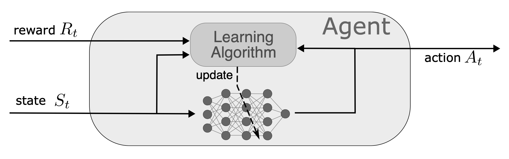
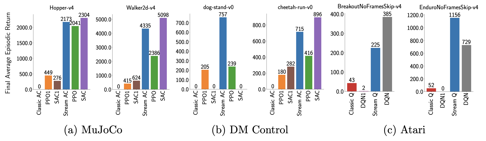

# Streaming Deep Reinforcement Learning

<p align="center">
  
</p>

This is the official implementation of the <em>[Streaming Deep Reinforcement Learning Finally Works](https://arxiv.org/abs/2410.14606)</em> paper by [Mohamed Elsayed](http://mohmdelsayed.github.io), [Gautham Vasan](https://gauthamvasan.github.io), and [A. Rupam Mahmood](https://armahmood.github.io). We provide a minimal implementation (around 150 lines of code) of stream-x algorithms that allow ease of use and understanding. Specifically, we provide implementations for the following algorithms:

- Stream AC(λ) — continuous and discrete control
- Stream Q(λ) — discrete control
- Stream SARSA(λ) — discrete control


If you just want to quickly run the code, we provide Google Colab notebooks for:
- Stream AC(λ) with Ant-v4: [](https://colab.research.google.com/drive/1oM-PPxITvXVfJ_vqipqKE6mYUWHmte9y?usp=sharing)
- Stream Q(λ) with Atari Pong: [](https://colab.research.google.com/drive/13lgPs5O6Xqr0GKJuT8amGhXufNcN40qY?usp=sharing)

## Overview:
### What is streaming learning?
Learning from a continuous stream of experience as it arrives is a paramount challenge,
mirroring natural learning, and is relevant to many applications involving on-device learning. 
For instance, learning from recent experience can help systems 
adapt quickly to changes (e.g., wear and tear) compared to learning from potentially obsolete data. 
In streaming reinforcement learning, the agent receives an observation and reward at each step, 
taking action and making a learning update immediately 
without storing the sample. This scenario is practical since retaining raw
samples is often infeasible due to limited computational resources,
lack of communication access, or concerns about data privacy.

<p align="center">

</p>

### Stream Barrier

Existing streaming deep RL methods often experience instability and failure to learn, which we
refer to as stream barrier. This figure shows stream barrier in three different challenging
benchmarking tasks: MuJoCo, DM Control, and Atari. Classic streaming methods, namely
Q(λ) and SARSA(λ), AC(λ), perform poorly in these challenging tasks. Similarly, batch RL
methods such as PPO, SAC, and DQN struggle when used in streaming learning, which is achieved
with a buffer and a batch size of 1 and dubbed as PPO1, SAC1, and DQN1, respectively. Our stream-x
methods not only overcome the stream barrier, that is, learn stably and effectively in these
tasks, but also become competitive with batch RL methods and even outperform in some
environments.

<br/>

## Installation:
```
conda create -n drl python=3.11
conda activate drl
pip install -r requirements.txt
```

## How to use?
All algorithms can use ObGD or AdaptiveObGD defined in `optim.py` and should work without any hyperparameter tuning. You can use [Classical Control](https://gymnasium.farama.org/environments/classic_control/) environments, [MuJoCo](https://gymnasium.farama.org/environments/mujoco/) environments, [Atari](https://gymnasium.farama.org/environments/atari/) environments, or [dm_control](https://github.com/google-deepmind/dm_control/) environments.


First, you need to activate the python environment
```
conda activate drl
```

Now, you can run any of the following cmds:
```
python stream_ac_continuous.py --debug --env Ant-v4

python stream_ac_discrete.py --debug --env CartPole-v1
python stream_ac_discrete_atari.py --debug --env BreakoutNoFrameskip-v4
python stream_ac_discrete_minatar.py --debug --env MinAtar/Breakout-v1

python stream_q.py --debug --env CartPole-v1
python stream_q_atari.py --debug --env BreakoutNoFrameskip-v4
python stream_q_minatar.py --debug --env MinAtar/Breakout-v1

python stream_sarsa.py --debug --env CartPole-v1
python stream_sarsa_atari.py --debug --env BreakoutNoFrameskip-v4
python stream_sarsa_minatar.py --debug --env MinAtar/Breakout-v1
```
After one of these scripts is done, you can use `plot.py` to plot the learning curve.

## License

Distributed under the Creative Commons Attribution-NonCommercial 4.0 (CC BY-NC 4.0). License. See `LICENSE` for more information.


## How to cite

#### Bibtex:
```bibtex
@article{elsayed2024streaming,
  title={Streaming Deep Reinforcement Learning Finally Works},
  author={Elsayed, Mohamed and Vasan, Gautham and Mahmood, A Rupam},
  journal={arXiv preprint arXiv:2410.14606},
  year={2024}
}
```

#### APA:
Elsayed, M., Vasan, G., & Mahmood, A. R. (2024). Streaming Deep Reinforcement Learning Finally Works. <em>arXiv preprint arXiv:2410.14606</em>.


## Contributing

If you have a suggestion that would improve the code quality or if you want to add an implementation of a classic streaming reinforcement learning (e.g., double Q-learning) using our apporach to make it work with deep neural networks, please fork this repo and create a pull request. Here are the steps to make this possible:

1. Fork the Project
2. Create your branch (git checkout -b my_branch)
3. Commit your changes (git commit -m 'Add some new idea')
4. Push to your changes (git push origin my_branch)
5. Open a Pull Request

## Acknowledgement
We thank Adrian Orenstein and Jiamin He for testing the code and providing helpful feedback. 